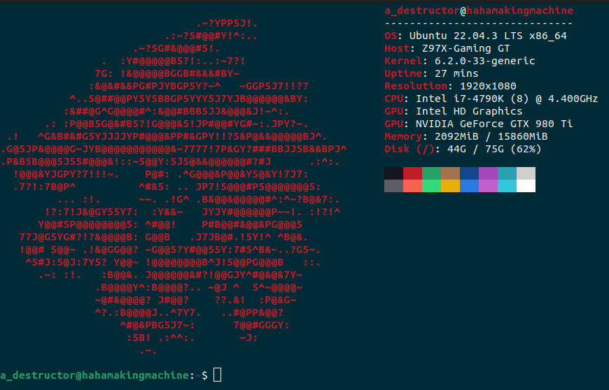

# Embedded_Linux_From_Scratch_On_RPi4

This README file's purpose is solely to facilitate navigating between the different projects I have worked on that make up this from scratch embedded linux system on my Raspberry Pi 4.

An embedded linux system mainly consists of four parts:
  1. [Toolchain](https://github.com/AhmedAlyEl-Ghannam/Crosstool-NG_RPi4): to cross compile system components and programs to target hardware. I used Crosstool-NG to generate mine.
  2. [Bootloader](https://github.com/AhmedAlyEl-Ghannam/Our-Boot_U-Boot_bootloader_for_RPi4): to load the system itself. I generated a U-Boot based one.
  3. [Linux kernel cross compiled for target hardware](https://github.com/AhmedAlyEl-Ghannam/Linux_Kernel_Built_For_RPi4): I compiled a stable release of linux using the toolchain I generated earlier.
  4. [Root filesystem](https://github.com/AhmedAlyEl-Ghannam/Root_and_Utils_Using_Busybox): I generated a basic filesystem and a simple shell using Busybox.

 
My PC specifications

Target hardware is Raspberry Pi 4B 8GB Rev 1.5 with the following pinout:

I used this USB to TTL converter to communicate with the Pi using `gtkterm`

The following is a list of resources/links that have helped me immensely along this journey:
1. Book: Mastering Embedded Linux Programming, by Chris Simmonds.
2. Youtube Playlist: [Embedded Linux, Moatasem El-Sayed {Arabic}](https://www.youtube.com/playlist?list=PLkH1REggdbJpFXAzQqpjZgV1oghPsf9OH).
3. Github Repo: [Linux_Raspberrypi3b_image, Moatasem El-Sayed](https://github.com/Moatasem-Elsayed/Linux_Raspberrypi3b_image).
4. Github Repo: [u-boot-rpi3-b-plus, Mohamed Hassanin Omran](https://github.com/mhomran/u-boot-rpi3-b-plus).
5. Documentation: [Raspberry Pi 4B Official Documentation](https://www.raspberrypi.com/documentation/).
6. Blog: [Boot a Raspberry Pi 4 using u-boot and Initramfs, Hechao's Blog](https://hechao.li/2021/12/20/Boot-Raspberry-Pi-4-Using-uboot-and-Initramfs/).
7. Blog: [Build a Raspberry Pi Linux System the Hard Way, Rick Carlino](https://rickcarlino.com/2021/build-a-raspbery-pi-linux-system-the-hard-way.html).

That's all folks!
